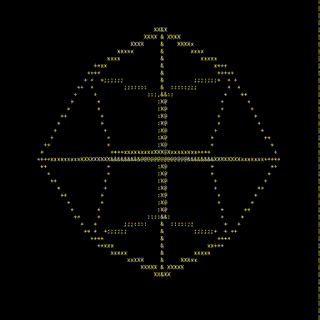

# 4d-tesseract-console
4D animated tesseract in console, written in C.



Compile with CLANG:
```bash
clang main.c -o tesseract -lm
```

Compile with GCC:
```bash
gcc main.c -o tesseract -lm
```

Run:
```bash
./tesseract
```
